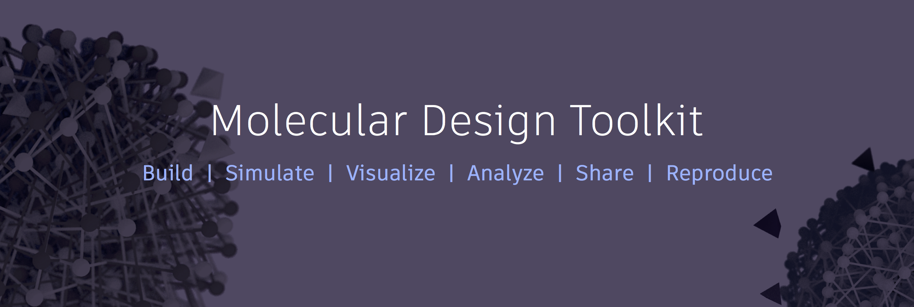

[](https://badge.fury.io/py/moldesign) <a href="https://badge.fury.io/gh/Autodesk%2Fmolecular-design-toolkit" style="font-family: 'Helvetica Neue', Helvetica, Arial, sans-serif; background-color: rgb(70, 61, 84);">
                                    &nbsp;
                                </a> <a href="https://github.com/autodesk/molecular-design-toolkit/blob/master/LICENSE" style="font-family: 'Helvetica Neue', Helvetica, Arial, sans-serif; background-color: rgb(70, 61, 84);"> </a> [](https://gitter.im/molecular-design-toolkit/Lobby?utm_source=badge&utm_medium=badge&utm_campaign=pr-badge)
                                
**Try it now:** [](http://mybinder.org:/repo/avirshup/mdt-gallery-test)

# Molecular Design Toolkit
Molecular modeling without the pain - a Python 2.7 library offering integrated simulation, visualization, analysis, and cloud computing. 

The toolkit aims to lower the barriers between you and your science by integrating mature, open source simulation packages with a readable abstract API, Jupyter notebook visualization, and native cloud computing.

## Get started
On the command line, run:
```shell
pip install moldesign
python -m moldesign intro
```

Note: depending on how python is installed on your system, some users may need to install the package as root: `sudo pip install moldesign`.

The best way to get started is to play with the examples that `python -m moldesign intro` will pull up. See [the documentation](https://autodesk.github.io/molecular-design-toolkit/) for complete API docs, development instructions and other installation scenarios.

## Code Example

You'll almost always import the package and its units module:
```python
import moldesign as mdt
from moldesign import units as u
```

Download a protein from the PDB and visualize it in 3D (in a notebook):
```python
protease = mdt.from_pdb('3AID')
protease.draw()
```

Create a small molecule and relax its geometry:
```python
mol = mdt.from_name('bipyridine')
mol.set_energy_model(mdt.models.RHF(basis='STO-3G'))
min_trajectory = mol.minimize(nsteps=20)
min_trajectory.draw_orbitals()
```

For in-depth examples, see the built-in example notebooks (run `python -m moldesign intro` to launch).


## Get help
 - [API Documentation](https://autodesk.github.io/molecular-design-toolkit)
 - [Forums](https://forum.bionano.autodesk.com/c/Molecular-Design-Toolkit)
 - [Email us](mailto:moleculardesigntoolkit@autodesk.com)


## Contributing

See [CONTRIBUTING.md](CONTRIBUTING.md) for details. Note that the [Notebook Molecular Visualization](https://github.com/autodesk/notebook-molecular-design) library and [PyCloudComputeCannon](https://github.com/autodesk/py-cloud-compute-cannon) are also developed under this project's umbrella.

## License

See [NOTICES](NOTICES) for details about incorporated code.

Copyright 2016 Autodesk Inc.

Licensed under the Apache License, Version 2.0 (the "License"); you may not use this file except in compliance with the License. You may obtain a copy of the License at

http://www.apache.org/licenses/LICENSE-2.0

Unless required by applicable law or agreed to in writing, software distributed under the License is distributed on an "AS IS" BASIS, WITHOUT WARRANTIES OR CONDITIONS OF ANY KIND, either express or implied. See the License for the specific language governing permissions and limitations under the License.
