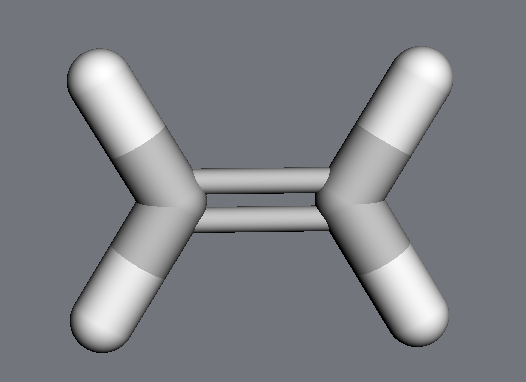
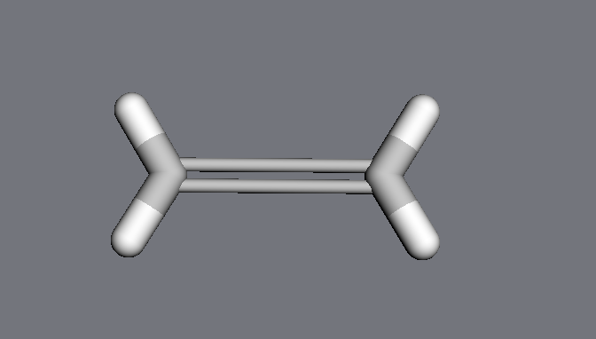
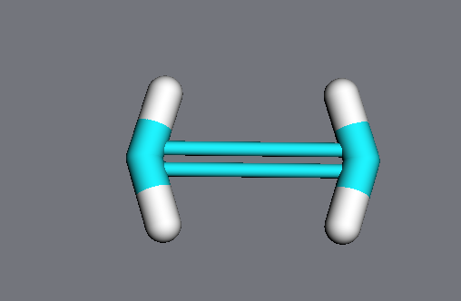
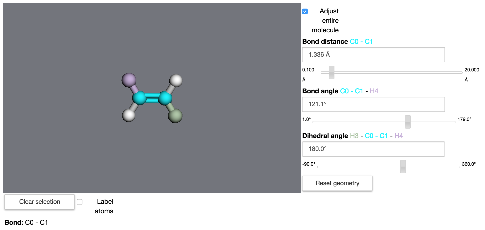

Geometry tools
==============

Atomic positions
----------------

.. image:: img/atompos.png
   :scale: 50%

Atomic positions are accessible both as vectors and scalars:

   >>> mol = mdt.from_smiles('CCC')
   >>> atom = mol.atoms[0]
   >>> atom.position
   <Quantity([ 0.99016981  0.04194212  0.10581842], 'ang')>
   >>> atom.x
   <Quantity(0.990169808818, 'ang')>
   >>> atom.z
   <Quantity(0.105818418471, 'ang')>

These quantities can be updated, not just read. Everything is kept automatically in sync - changing ``atom.position`` will automatically change ``atom.x, atom.y`` and ``atom.z``, and vice versa:

   >>> atom.x = 5.0 * u.angstrom
   >>> atom.position
   <Quantity([ 5.          0.04194212  0.10581842], 'ang')>
   >>> atom.position = [0,0,0] * u.angstrom
   >>> atom.x, atom.y, atom.z
   (<Quantity(0.0, 'ang')>, <Quantity(0.0, 'ang')>, <Quantity(0.0, 'ang')>)

Internal coordinates
--------------------

The :mod:`moldesign.geom` module contains a variety of methods for measuring (and
manipulate geometry).

You can get the distance between any two atoms with the
:meth:`atom.distance <moldesign.Atom.distance>` method.

  >>> atom1.distance(atom2)
  [...] angstrom

Bond angles and dihedral (twist) angles can be measured using the :meth:`moldesign.angle`
and :meth:`moldesign.dihedral` methods:

    >>> moldesign.angle(atom1, atom2, atom3)
    [...] radians
    >>> moldesign.dihedral(atom1, atom2, atom3, atom4)
    [...] radians

Measuring a dihedral (or twist) angle can be a pain, because they are defined as a function of *four* atomic positions.  For quick measurements, you can pass in only the two central atoms in the dihedral, and MDT will infer the others. Any of the following call signatures will work:

   >>> moldesign.dihedral(a1, a2, a3, a4)
   >>> moldesign.dihedral(a1, a2)
   >>> moldesign.dihedral(bond)

For applications that require derivatives, the gradients of these quantites are also available using the :meth:`moldesign.distance_gradient`, :meth:`moldesign.angle_gradient`, and :meth:`moldesign.dihedral_gradient`.

Manipulating coordinates
------------------------

Internal coordinates can also be manipulated using the :meth:`moldesign.set_distance`, :meth:`moldesign.set_angle`, and :meth:`moldesign.set_dihedral` functions.

Note that these functions can work in two ways. We'll illustrate this with ethylene:

   >>> ethylene = mdt.from_smiles('C=C')
   >>> ethylene.draw3d()

By default, MDT will move all atoms affected by the change (equivalent to manipulating the molecule's internal coordinates). Here, although we only explicitly change the distance between the two carbons, the methylene groups move as well:

   >>> mdt.set_distance(ethylene.atoms[0], ethylene.atoms[1], 3.0 * u.angstrom)

However, if the keyword ``adjustmol`` is set to ``False``, *only the specified atoms* will be moved; the hydrogens stay in their original positions:

   >>> ethylene = mdt.from_smiles('C=C')
   >>> mdt.set_distance(ethylene.atoms[0], ethylene.atoms[1],
   >>>                  3.0 * u.angstrom,
   >>>                  adjustmol=False)
   >>> ethylene.draw3d()

In notebooks, these quantities can be changed interactively using the :class:`GeometryBuilder <moldesign.widgets.GeometryBuilder>` widget:

   >>> mdt.GeometryBuilder(ethylene)

Monitor coordinates
-------------------

:class:`Geometry monitor <moldesign.geom.GeometryMonitor>` classes can simplify the process of tracking and manipulating internal coordinates.

   >>> ethylene = mdt.from_smiles('C=C')
   >>> distance_monitor = mdt.DistanceMonitor(ethylene.atoms[0], ethylene.atoms[1])
   >>> distance_monitor.value
   <Quantity(1.51205701815, 'ang')>
   >>> ethylene.draw3d()

Changing the monitor's value will *change the molecular geometry*:

   >>> distance_monitor.value = 3.0 * u.angstrom
   >>> ethylene.draw()

Groups of atoms
---------------

Most groups of atoms in MDT - including molecules, residues, and even arbitrary lists of atoms in :class:`AtomLists <moldesign.AtomList>` - have built-in geometric analysis and manipulation methods (inherited from the :class:`AtomContainer <moldesign.molecules.atomcollections.AtomContainer>` class).

Analysis methods include calculating a center of mass,

   >>> mol = mdt.from_pdb('1YU8')
   >>> mol.center_of_mass
   <Quantity([ 10.59496153  15.55064957  21.02801831], 'ang')>
   >>> mol.residues[0].center_of_mass
   <Quantity([ 10.24884993  27.76183367  19.85926777], 'ang')>

the distance between two groups of atoms (i.e., the minimum distance between any pair of atoms in the two objects),

   >>> r1 = mol.residues[0]
   >>> r2 = mol.residues[1]
   >>> r1.distance(r2)
   <Quantity(1.32810161367, 'ang')>

and arrays of distances between the atoms in two objects:

   >>> array = r1.calc_distance_array(r2)
   >>> array
   <Quantity([[ 3.49805684  4.74654325  ...]
              [ 2.43405388  3.8018831   ...]
                ...], 'ang')>

where ``array[i,j] == r1.atoms[i].distance(r2.atoms[j])``.

In addition, groups of atoms can be moved using their :meth:`translate <moldesign.molecules.atomcollections.AtomContainer.translate>` and :meth:`rotate <moldesign.molecules.atomcollections.AtomContainer.rotate>` methods.

Analyze dynamics
----------------

WIP

Constrain geometry
------------------

Geometric constraints - coordinates that are held constant during dynamics or minimizations - can be created using :class:`Molecule <moldesign.Molecule>` methods:

   >>> dist_constraint = mol.constrain_distance(mol.atoms[0], mol.atoms[1])
   >>> ang_constraint = mol.constrain_angle(mol.atoms[0], mol.atoms[1], mol.atoms[2])

These :class:`constraint <moldesign.geom.constraints.GeometryConstraint` objects can be queried:

   >>> dist_constraint.error()
   <Quantity(0.0, 'ang')>
   >>> dist_constraint.satisfied()
   True

and can be manipulated via their ``value`` and ``tolerance`` attributes.

For convenience, constraints can also be created from :class:`Geometry monitor <moldesign.geom.GeometryMonitor>` objects:

   >>> distance = mdt.DistanceMonitor(mol.atoms[0], mol.atoms[1])
   >>> constraint = distance.constrain()

Molecular constraints are stored in a list at ``molecule.constraints``. To remove all constraints from a molecule, use the :class:`clear_constraints <moldesign.Molecule.clear_constraints>` method.