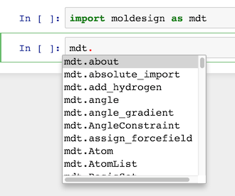

===========================================
Molecular Design Toolkit: API documentation
===========================================

These pages provide reference API documentation for the Molecular Design Toolkit.

Just getting started? We recommend trying out `the tutorials and
walkthroughs <http://bionano.autodesk.com/MolecularDesignToolkit/explore.html>`_ before diving into the API.

Quick install
-------------
Get the latest stable version:

.. code-block:: bash

   $ pip install moldesign

Or get the source code on github:

.. code-block:: bash

   $ git clone github.com/autodesk/molecular-design-toolkit

Get started
-----------
At the command line, run

.. code-block:: bash

   $ python -m moldesign intro

Explore the API
---------------
The Jupyter online documentation system is a powerful tool for discovering functionality.

To get a list of all members of a module or class, type ``modulename.``, then hit `tab`.

To get online documentation about a function or method, type the method's name, then hit `shift+tab`

.. image:: img/shifttab_online.png

To get the complete docstring for any object, type its name then a question mark.

.. image:: questiondoc.png

Get help
--------
Click a link in the navigation menu (to your left) for in-depth documentation.
