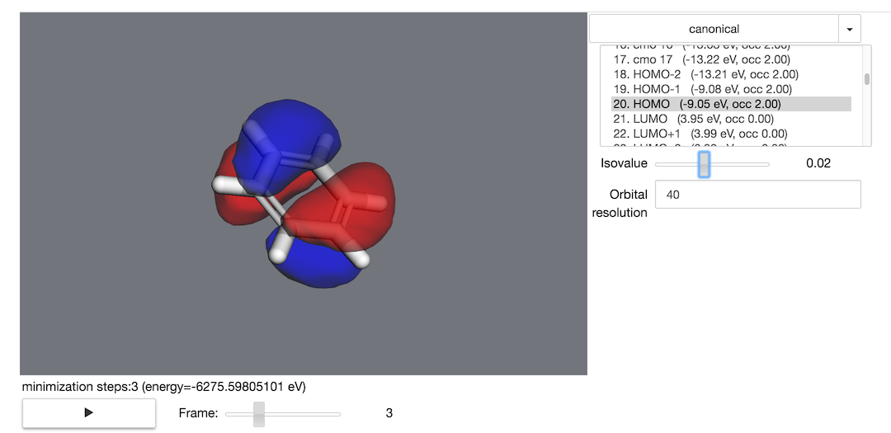

Property calculations
=====================

Optimize a geometry
-------------------
First, you'll need to create an :class:`EnergyModel <moldesign.EnergyModelBase>` for your molecule. Energy models can include quantum chemical, molecular mechanics, or wide assortment of other methods.

We'll follow the same setup as the previous step:

   >>> mol = mdt.from_name('benzene')
   >>> mol.set_energy_model(mdt.models.RHF(basis='sto-3g'))

Now that our molecule has an :class:`EnergyModel <moldesign.EnergyModelBase>`, we can calculate energies and forces:

   >>> mol.calculate_forces() # returns vector of forces
   >>> mol.calculate_potential_energy() # returns the molecule's energy

You're now ready to use the molecule's :meth:`minimize <moldesign.Molecule.minimize>` method:

   >>> trajectory = mol.minimize(nsteps=10, frame_interval=1)

And you can visualize the minimization process using the trajectory object:

   >>> trajectory.draw_orbitals()

