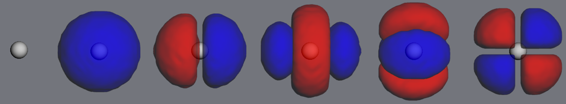
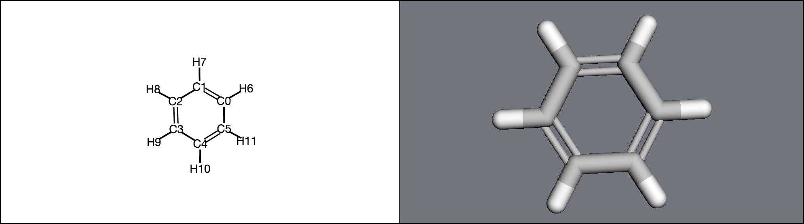

Molecular structure
-------------------
MDT is built around python objects that try to mirror their physical counterparts. For instance,
a ``Molecule``'s atoms are a list at ``molecule.atoms``; its mass is stored at ``molecule.mass`` and
its charge at ``molecule.charge``. ``Atoms``, similarly,
have an atomic number (``atom.atnum``), a mass (``atom.mass``), a position (``atom.position``), and
a momentum (``atom.momentum``).

These properties are interrelated - for instance, changing an atom's mass will also affect its
molecule's total mass. As much as possible, MDT will automatically take care of this bookkeeping
for you.

Below is a quick rundown of
those objects and how they relate to one another.

For most of the examples here, we'll look at a benzene molecule, which you can create as follows:
   >>> import moldesign as mdt, moldesign.units as u
   >>> benzene = mdt.from_name('benzene')

Atoms
"""""

An :class:`Atom <moldesign.Atom>` object contains physical information,

   >>> atom = mdt.Atom('C')
   >>> atom.atomic_number
   6
   >>> atom.mass
   12.0 * u.amu
   >>> atom.position
   [0.0, 0.0, 0.0] * u.angstrom

the bonds it's involved in,

    >>> atom = benzene.atoms[0]
    >>> atom.bonds
    [<Bond: C3 (#3) - C4 (#4) (order: 1)>,
     <Bond: C2 (#2) - C3 (#3) (order: 2)>,
     <Bond: C3 (#3) - H9 (#9) (order: 1)>]
    >>> atom.bond_graph
     {<Atom C2 (elem C), index 2 in molecule Molecule: benzene>: 2,
      <Atom C4 (elem C), index 4 in molecule Molecule: benzene>: 1,
      <Atom H9 (elem H), index 9 in molecule Molecule: benzene>: 1}

and contains references to the larger structures it belongs to.

   >>> mol = mdt.from_pdb('3fpp')
   >>> atom = mol.atoms[0]
   >>> atom
   <Atom N (elem N), index 0 (res PRO43 chain A) in molecule Molecule: 3fpp>
   >>> atom.molecule
   <3fpp (Molecule), 4097 atoms>
   >>> atom.residue
   <Residue PRO43 (index 0, chain A) in Molecule: 3fpp>
   >>> atom.chain
   <Chain A in Molecule: 3fpp>

Bonds
"""""

.. image:: img/bonds.png

An iterator over a molecule's :class:`bonds <moldesign.Bond>` is stored at ``molecule.bonds``:

    >>> list(benzene.bonds)
    [<Bond: C4 (#4) - H10 (#10) (order: 1)>,
     <Bond: C4 (#4) - C5 (#5) (order: 2)>,
     ...]

Each bond contains references to the two bonded atoms, and the Lewis structure bond order:

   >>> bond = list(benzene.bonds)[0]
   >>> bond
   <Bond: C3 (#3) - C4 (#4) (order: 1)>
   >>> bond.a1
   <Atom C3 (elem C), index 3 in molecule Molecule: benzene>
   >>> bond.a2
   <Atom C4 (elem C), index 4 in molecule Molecule: benzene>
   >>> bond.order
   1

If you have one atom in a bond, and need to get the *other* atom, use the :meth:`bond.partner <moldesign.Bond.partner>` method:

   >>> atom = benzene.atoms[0]
   >>> atom
   <Atom C0 (elem C), index 0 in molecule Molecule: benzene>
   >>> bond = atom.bonds[0]
   >>> bond.partner(atom)
   <Atom C1 (elem C), index 1 in molecule Molecule: benzene>

Bonding information can also be accessed as a :meth:`bond graph<moldesign.Molecule.bond_graph>`:

    >>> benzene.bond_graph
    {<Atom C1 (elem C), index 1 in molecule Molecule: benzene>:
          {<Atom C0 (elem C), index 0 in molecule Molecule: benzene>: 2,
           <Atom C2 (elem C), index 2 in molecule Molecule: benzene>: 1,
           <Atom H7 (elem H), index 7 in molecule Molecule: benzene>: 1},
     <Atom C0 (elem C), index 0 in molecule Molecule: benzene>:
          {<Atom C1 (elem C), index 1 in molecule Molecule: benzene>: 2,
           ...},
     ...}

Molecules
"""""""""

You'll spend most of your time in MDT working with :class:`Molecules <moldesign.Molecule>` - which, technically, represent completely molecular systems.

Each :class:`Molecule <moldesign.Molecule>` contains a list of :class:`Atoms <moldesign.Atom>`.

   >>> len(benzene.atoms)
   12
   >>> atom = benzene.atoms[3]
   >>> atom.index
   3

The 3D positions and momenta of all atoms in a molecule are stored as an Nx3 array:

   >>> benzene.positions
   <Quantity([[-0.76003939  1.16931777  0.02273989]
    [ 0.63314801  1.24365634 -0.01297972]
    ..., 'ang')>
   >>> benzene.momenta
   <Quantity([[ 0.  0.  0.]
    [ 0.  0.  0.]
    ..., 'amu * ang / fs')>

Molecular properties
""""""""""""""""""""
   .. image:: img/properties.png

:class:`Molecular properties<moldesign.molecules.molecule.MolecularProperties>` are quantities
that have been calculated by an :class:`energy model<moldesign.models.base.EnergyModelBase>` at the
molecule's current position.

For instance: if forces on the molecule have been calcualted, they are stored in an Nx3 array similarly to positions and momenta. However, they must first be calculated by an :class:`EnergyModel <moldesign.models.base.EnergyModelBase>`:

   >>> benzene.forces
   Traceback ...
   NotCalculatedError: The 'forces' property hasn't been calculated yet. Calculate it with the molecule.calculate_forces() method
   >>> benzene.set_energy_model(mdt.models.GAFF, charges='am1-bcc')
   >>> benzene.calculate_forces()
   >>> benzene.forces
   <Quantity([[ -1.25171801e-01   1.93601314e-01   9.20898239e-04]
    ..., 'eV / ang')>

Any quantities calculated by the energy model are stored in ``molecule.properties``:

   >>> benzene.properties
   {'am1-bcc': ...,
    'forces': ...,
    'potential_energy': ...,
    'positions': ...}

Properties almost always include ``potential_energy``; other common properties include
``forces``, ``wfn``, and ``dipole``. Calling ``mol.calculate()`` will only calculate the model's
default quantities (see ``model.DEFAULT_PROPERTIES`` for a given model). Additional properties,
if available, can be requested via ``mol.calculate(requests=[prop1, prop2, ...])``

Note:
   These properties are only accessible if they correspond to the molecule's current position -
   MDT will raise ``NotCalculatedError`` if you try to access properties at a new position without
   explicitly asking for a calculation.

   >>> benzene.calculate()
   >>> benzene.potential_energy
   -6201.2054456 * u.eV
   >>> mdt.set_angle(benzene.atoms[0], benzene.atoms[1], benzene.atoms[2], 5.0*u.degrees)
   >>> benzene.potential_energy
   Traceback (most recent call last):
    ...
   NotCalculatedError: The 'potential_energy' property hasn't been calculated yet. ...
   >>> benzene.calculate_potential_energy()
   -6200.9382913 * u.eV

Electronic structure
""""""""""""""""""""
   .. image:: img/wfn.png

If you've run an quantum chemistry calculation on a molecule, its :class:`electronic structure <moldesign.orbitals.wfn.ElectronicWfn>` will also
be available. This information is accessible through:
:class:`mol.wfn (see its documentation for more details) <moldesign.orbitals.ElectronicWfn>`.
    >>> mol.set_energy_model(mdt.models.RHF, basis='sto-3g')
    >>> mol.calculate()
    >>> wfn = benzene.wfn
    >>> wfn.aobasis
    <BasisSet (sto-3g) of Molecule: benzene>
    >>> wfn.orbitals
    {'atomic': <BasisSet (sto-3g) of Molecule: benzene>,
     'canonical': <36 canonical MolecularOrbitals in None/sto-3g wfn>}

