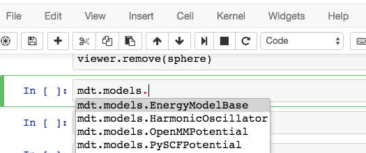
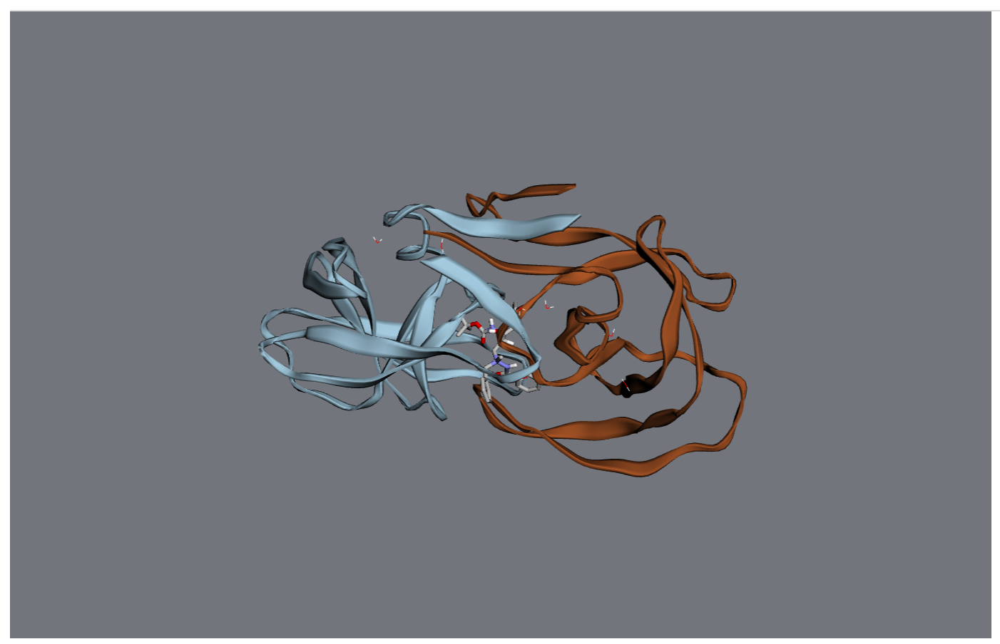
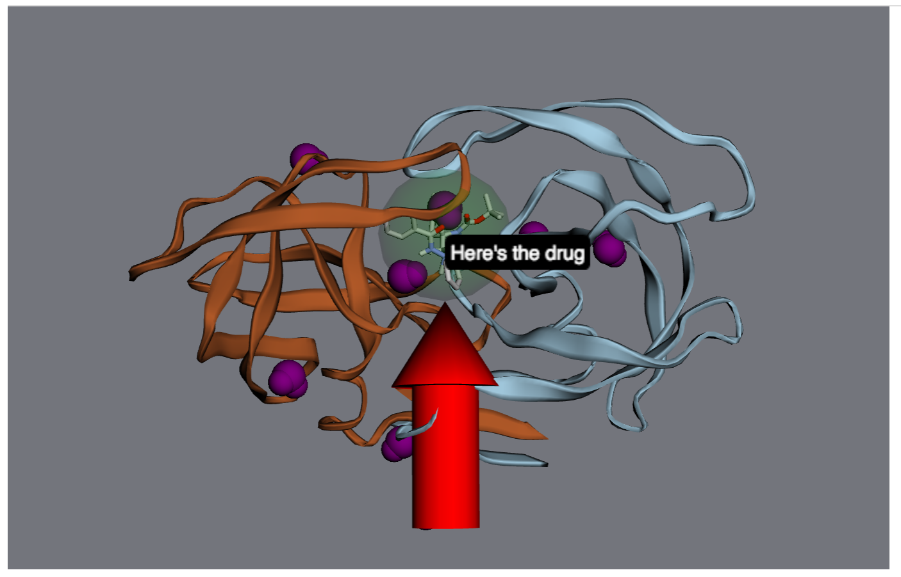

Visualization
=============

Visualize molecular orbitals
----------------------------
First, you'll need to calculate the molecule's electronic structure using a quantum chemistry
model. Quantum chemistry models are a type of
:class:`Energy Model <moldesign.models.EnergyModelBase>` in MDT.

You can use iPython's autocomplete to get a list of the available methods by typing
``mdt.models.`` and then hitting the ``Tab`` key:

In this example, let's set up a small molecule with a simple quantum chemistry model -
`restricted Hartree-Fock. <https://en.wikipedia.org/wiki/Hartree-Fock_method>`_

   >>> mol = mdt.from_name('benzene')
   >>> mol.set_energy_model(mdt.models.RHF(basis='6-31g'))

Next, we'll run a calculation with this model - this will calculate several relevant properties for
the molecule.

   >>> mol.calculate()
   >>> mol.potential_energy
   -6275.56597497 eV
   >>> mol.wfn
   <ElectronicWfn (rhf/6-31g) of Molecule: benzene>

These properties are stored in a :class:`dict` at ``mol.properties``:

   >>> mol.properties.keys()
   ['wfn', 'positions', 'mulliken', 'potential_energy']

Most relevant for our purposes, we've calculated the electronic state of the molecule and are
ready to visualize it.

   >>> mol.draw_orbitals()

   .. image:: img/howdoi_orbs.png

In an actual notebook, you can use the controls on the right to control the visualization.

Maniuplate a 3D visualization
-----------------------------
First, create a viewer. It will be rendered in your notebook when it's the last object evaluated in a code cell.

   >>> import moldesign as mdt
   >>> from moldesign import units as u
   >>> mol = mdt.from_pdb('3AID')
   >>> viewer = mol.draw3d()
   >>> viewer

At this point, the viewer will be drawn into your notebook. You can continue to manipulate it after it's been drawn.

For starters, let's turn all the waters purple.

   >>> wateratoms = [atom for atom in mol.atoms if atom.residue.type == 'water']
   >>> viewer.vdw(atoms=wateratoms, color='purple')

.. image:: img/howdoi_purplewater.png

Next, let's make that drug molecule really stand out with with a transparent sphere, an arrow,
and a label:

   >>> drug = mol.chains['A'].residues['ARQ401']
   >>> r = drug.center_of_mass
   >>> sphere = viewer.draw_sphere(position=r, radius=6*u.angstrom, opacity=0.5, color='green')
   >>> arrow = viewer.draw_arrow(start=r+[0,0,26]*u.angstrom, end=r+[0,0,6]*u.angstrom, radius=3)
   >>> label = viewer.draw_label(text="Here's the drug", position=r)

Maybe that's too much - let's remove the label and the sphere.

   >>> viewer.remove(label)
   >>> viewer.remove(sphere)

.. image:: img/howdoi_subtle.png

